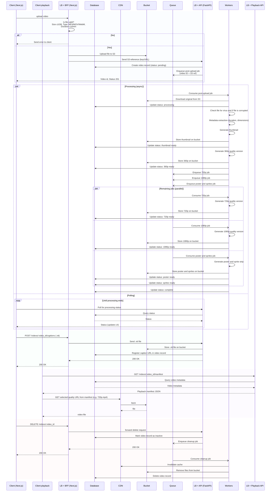

# Fullstack Engineer Challenge — System Design Review

Given the nature of demonstrating flows between system components, I chose to port the existing diagram to a sequence diagram and to point out the improvements in this new diagram.

## Problems in the original design

1. The full file (up to 1 GB) is transferred twice, from client to BFF and from BFF to API. With 500 concurrent uploads this kills the BFF.
2. There is no database, so there's no way to store video metadata or processing status. Polling doesn't work without it.
3. Processing is synchronous, the client waits for everything to finish before getting a response. Can't hit ≤15s for the first playable version.
4. Only 2 quality versions are generated (360p, 720p) but should be 3 (360p, 720p, 1080p).
5. Poster image is required but not generated.
6. Trick-play preview needs thumbnail sprites but the diagram only generates a single thumbnail.
7. Client needs an ID to poll for processing status but the diagram has no polling mechanism.
8. Diagram says "After video is completely download, user can playback." A 1 GB file on 10 Mbps takes ~13 min. Start time target is ≤2.0s.
9. CDN cache is set to 600s but deletion must propagate in ≤60s. Video stays playable from cache up to 10 min after deletion.
10. There is no delete flow in the diagram.
11. Optional .vtt caption upload/display is missing from the diagram.
12. Single BFF, single API, no load balancing. Can't hit 99.9% or 99.0% availability.

---

## Decisions and why

| Decision                                        | Why                                                                                                                                                                  |
| ----------------------------------------------- | -------------------------------------------------------------------------------------------------------------------------------------------------------------------- |
| Availability 99.0% for upload                   | Dedicated upload LB + multiple BFF/API instances; on the order of 500 concurrent uploads; path isolated from playback LB. Async queue/workers for heavy work.        |
| Client upload (progress, cancel, retry)         | axios onUploadProgress to track upload progress; cancel clears React state; retry on transient errors (e.g. timeout, 503).                                           |
| BFF uploads to S3, sends only the S3 key to API | Avoids sending the full 1 GB file through the API. Fewer network hops.                                                                                               |
| S3 object layout                                | Under `/videos/:video_id/`: `original.*`, `thumb.jpg`, `360p.mp4`, `720p.mp4`, `1080p.mp4`, `poster.jpg`, `sprites.jpg`; caption object when uploaded.               |
| Queue between API and Workers                   | Decouples upload from processing. Client gets the ID back fast and polls for status.                                                                                 |
| 20k uploads/day is fine                         | ~0.23/s average; even at high peak, upload LB + queue absorb load.                                                                                                   |
| Ingest job: scan, metadata, thumb, then 360p    | API enqueues one post-upload job. Worker runs virus scan and metadata first, then thumbnail, then 360p. Then enqueues 720p, 1080p, and poster/sprites jobs.          |
| One job per version (after ingest)              | 720p, 1080p, and poster/sprites are separate jobs after the post-upload job; they run in parallel. If one fails, only that job is retried.                           |
| First playable (360p) latency                   | Target ≤15s P95 from upload complete to first playable 360p (thumbnail and 360p both follow scan/metadata in the ingest job).                                        |
| Workers sized for CPU/RAM                       | P95 processing ≤10min for a 10-min source; parallel transcodes bounded by the slowest branch. Capacity matches both that target and the first-playable target above. |
| Availability 99.9% for playback                 | Dedicated playback LB + multiple Playback API instances; on the order of 5k concurrent viewers; path isolated from upload LB. CDN serves media files.                |
| Playback API serves the manifest, not CDN       | Deletion is immediate at the API: inactive record → no manifest. No reliance on CDN TTL for that decision.                                                           |
| Video files on CDN with 600s cache              | Immutable (versioned) object keys → safe long TTL. CDN edge reduces latency; supports the playback abandonment target.                                               |
| Progressive download, no HLS/DASH               | Adaptive streaming is not required. Progressive download + CDN supports ≤2.0s start time. Playback can start once a 360p URL from the manifest is used.              |
| Async cleanup on delete                         | Mark inactive first, then enqueue cleanup. Worker invalidates CDN and deletes objects; retry if cleanup fails.                                                       |

---

## Diagram

